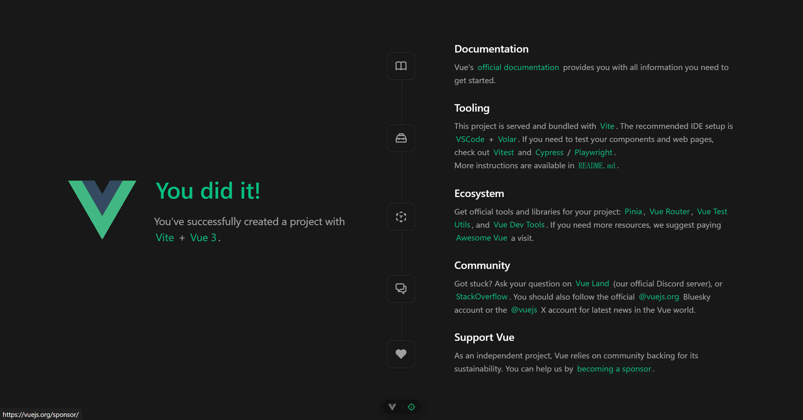

# Vue3 学习笔记

## 搭建 Vue3 环境

### 搭建开发环境

1. 安装NodeJS

直接前往[官网](https://nodejs.org/zh-cn)下载稳定版本即可, 不需要下载最新的版本, 防止一些意外的Bug


安装自行根据官网走就行, 一直点击继续即可正常安装.

---

2. 开发工具

可以使用[Vs Code](https://code.visualstudio.com/), 但是我更加推荐[WebStorm](https://www.jetbrains.com/webstorm/), 这个软件目前是**免费的**, 并且它对Vue3的开发更加友好, 同时不需要添加各种各样的插件, 直接一步到位!


---

3. 浏览器环境

默认的`Edge`即可, 已经很好用了.

### 创建第一个Vue项目

对于我们来说, 一般都是使用`npm`进行安装的. 我们直接使用npm创建一个基础项目即可:

```bash
npm create vue@latest
```

可以参考下面的配置:

```bash
Vue.js - The Progressive JavaScript Framework

√ 请输入项目名称： ... vue3-test
√ 是否使用 TypeScript 语法？ ... 否 / _是_
√ 是否启用 JSX 支持？ ... 否 / _是_
√ 是否引入 Vue Router 进行单页面应用开发？ ... _否_ / 是
√ 是否引入 Pinia 用于状态管理？ ... _否_ / 是
√ 是否引入 Vitest 用于单元测试？ ... _否_ / 是
√ 是否要引入一款端到端（End to End）测试工具？ » 不需要
√ 是否引入 ESLint 用于代码质量检测？ » 否

正在初始化项目 D:\Documents\WorkSpace\vue3-test...

项目初始化完成，可执行以下命令：

  cd vue3-test
  npm install
  npm run dev
```

这里只需要进入目录后执行`npm install`, 随后使用`WebStorm`打开项目目录即可.


这里配置一下启动项目, 方便运行, 可以参考下面的配置项目:

|  |  |
| ------------------------------------------------------------ | ------------------------------------------------------------ |

随后, 点击运行按钮, 程序就跑起来啦! 可以打开浏览器查看效果!



## Vue3 的模板语法 + Attribute 绑定

### 模板语法

对于Vue3来说, 可以使用一些特殊的语法, 把JS中的变量, 渲染在页面当中. 对于文本来说, 就可以直接使用插值语法.

这里为了方便学习, 我删除了`src`目录中的大部分代码, 仅保留了如下内容:


我们直接进入`App.vue`开始开发就好!

这里直接配置一个默认的内容:

```vue
<script setup>
</script>

<template>
  <div>这是Hello World</div>
</template>

<style scoped>
</style>
```

随后打开浏览器, 应该就可以看到页面已经显示出来了!


这就是当前文件的配置了, 下面的style就是样式, 只会作用于当前组件, 可以随便编写.

我们在`script`中, 定义一个变量, 比如name, 随后我们就可以在页面中使用插值语法获取这个值.

```vue
<script setup lang="ts">
const name: string = "Kaede Shimizu"
</script>

<template>
  <div>这是Hello World</div>
  <div>name 为: {{ name }}</div>
</template>
```


如果这里的文本里面有标签, 则不会正常渲染. 比如下面这样子:

```vue
<script setup lang="ts">
const name: string = "<h1>Kaede Shimizu</h1>"
</script>

<template>
  <div>这是Hello World</div>
  <div>name 为: {{ name }}</div>
</template>
```


所以, 插值语法只能用来渲染文本, 不能用来渲染HTML标签.

---

不过, 我们可以使用另外一个方法, 就是`v-html`, 这样就可以正常使用了:

```vue
<script setup lang="ts">
const name: string = "<h1>Kaede Shimizu</h1>"
</script>

<template>
  <div>这是Hello World</div>
  <div>name 为: {{ name }}</div>
  <div v-html="name"></di
```


这个的本质就是给div内嵌了一个标签, 可以通过查看源代码知晓.

### Attribute 属性绑定

上面的`v-html`起始就是一种绑定, 不过我们也可以绑定其他的东西, 比如把一个变量绑定到一个标签上.

这里有两种绑定的方法, 一种是`v-bind:id="xxx"`, 一种是去掉`v-bind`, 只保留`:`, 这是一种简写.

```vue
<script setup lang="ts">
const id: string = "10";
</script>

<template>
  <div v-bind:id="id">我绑定了ID属性</div>
  <div :id="id">我也有ID属性!</div>
</template>
```


---

对于按钮而言, 也可以用类似的方式进行绑定, 比如设置一个按钮不可点击, 就是`disabled`属性了, 设置为true, 或者直接写, 就是禁止

```vue
<script setup lang="ts">
const disabled = true;
</script>

<template>
  <button>你好 我可以点击</button>
  <button :disabled="disabled">我的状态取决于变量</button>
  <button disabled>我不可以点击</button>
</template>
```


对于链接来说, 我们可以动态的绑定一个链接的地址, 还是一样, 传入变量就可以绑定了

```vue
<script setup lang="ts">
const url = "https://www.bing.com"
</script>

<template>
  <a :href="url" target="_blank">点我跳转到一个链接</a>
</template>
```

## Vue3 实现响应式

推荐直接使用`ref()`即可, 这里就不介绍`reactive()`了, 它有很多的局限性, 不推荐使用.

`ref()`中, 传入一个自定义的数据值, 然后左值就会变成一个响应式的数据了. 这个响应式指的是, 只要修改值, 页面中使用该值的位置便会自动进行更新, 不需要手动刷新或者是监听这个数据.

### 基本案例

下面是最基本的一个响应式案例, 点击按钮后, 数字+1变化.

```vue
<script setup lang="ts">
import {ref} from "vue";

// 定义响应式数据
const counter = ref(0);

// 定义函数 用来让数据+1
const addNumber = () => {
  counter.value++
}
</script>

<template>
  <h1>当前counter = {{ counter }}</h1>
  <button @click="addNumber">点击后数字+1</button>
</template>
```


### DOM 更新时机

只要修改了响应式的信息, DOM就会自动进行更新, 但是这个更新并不是同步的, Vue会在**next tick**周期中, 缓冲所有状态的修改, 以确保每个组件只会更新一次. 如果是需要等待DOM渲染完成执行, 可以使用一个方法, nextTick, 以获取模板更新后的值.

直接调用`await nextTick()`即可, 这个方法可以直接引入.

```vue
<script setup>
import {ref, nextTick} from "vue";

// 定义响应式数据
const counter = ref(0);

// 定义函数 用来让数据+1
const addNumber = async () => {
  counter.value++
  console.log(document.getElementById('id').textContent)
  await nextTick()
  console.log(document.getElementById('id').textContent)
}
</script>

<template>
  <h1 id="id">当前counter = {{ counter }}</h1>
  <button @click="addNumber">点击后数字+1</button>
</template>
```


这里可以发现, 两次输出的log是不一样的, 这就是因为虽然页面变了, 但是DOM并没有完全改变, 需要等待一小段时间的.

## Vue3 基础核心知识点

### 计算属性

#### 基本使用

对于没有计算属性的部分, 我们可能需要在页面中写很多的东西, 这样子看起来就非常的不美观.

但是, 如果我们用普通的函数, 起始不会更新的, 这里就需要使用计算属性了, 让一个变量, 变成一个自动变化的内容.

```vue
<script setup>
import {ref} from "vue";

const list = ref({
  books: [
    '语文',
    '数学',
    '英语'
  ]
})
</script>

<template>
  <div>是否拥有数据: {{ list.books.length >= 0 ? "有" : "无"}}</div>
</template>
```

下面, 就对代码进行一些编辑, 创建一个新的变量, 用来记录数组内容的个数, 这个内容会随时根据变化修改, 实现响应式. 这个就是它的缓存性质了, 降低了页面的加载性能.

注意, 这里虽然是一个函数的定义, 但是本身就是返回值, 不需要写小括号的, 否则没用.

```vue
<script setup>
import {computed, ref} from "vue";

const list = ref({
  books: [
    '语文',
    '数学',
    '英语'
  ]
})
const listComputed = computed(() => {
  return list.value.books.length > 0 ? "Yes" : "No"
})
</script>

<template>
  <div>是否拥有数据: {{ listComputed }}</div>
</template>
```

#### 设置getter和setter

对于计算属性而言, 我们可以自定义读取它时触发的内容, 就是对应的钩子函数了. 这里创建计算属性的时候, 传入的就是一个对象了, 而不是一个函数.

```vue
<script setup>
import {computed, ref} from "vue";

const firstName = ref('Kaede')
const lastName = ref('Shimizu')

const fullName = computed({
  get() {
    return firstName.value + " " + lastName.value
  },
  set(newValue) {
    [firstName.value, lastName.value] = newValue.split(" ")
  }
})

</script>

<template>
  <div>全名为: {{ fullName }}</div>
  <button @click="e=>{fullName = 'Y Yt'}">修改名字为"Y Yt"</button>
</template>
```

这样点击按钮, 就会自动修改前端的文本了!

### 类与样式绑定

对于类来说, 可以直接通过一个`:`进行样式的绑定, 比如下面这样子, 绑定HTML的css.

```vue
<script setup>
import {computed, ref} from "vue";

const active = ref(true)

const change = () => {
  active.value = !active.value
}

// 使用计算属性 方便的设置一个类
const myClass = computed(() => {
  return active.value ? "active" : "not-active"
})
</script>

<template>
  <h1 :class="myClass">当前状态跟随按钮改变</h1>
  <button @click="change">点我切换状态</button>
</template>

<style scoped>
.active {
  color: green;
}

.not-active {
  color: red;
}
</style>
```

这个时候, 我们点击按钮, 就可以发现标题的颜色在跟随按钮的点击而发生变化了.

|  |  |
| :----------------------------------------------------------: | :----------------------------------------------------------: |

另外, 如果需要绑定的class比较多, 可以绑定一个数组来实现, 比如下面的按钮样式:

```vue
<script setup>
import {ref} from "vue";

const color = ref(true)
const size = ref(true)

const changeColor = () => {
  color.value = !color.value
  console.log("change Color 调用", color.value)
}

const changeSize = () => {
  size.value = !size.value
  console.log("change Size 调用", size.value)
}
</script>

<template>
  <div :class="[color ? 'green' : 'red', size ? 'big' : 'small']">你好</div>
  <button @click="changeColor">切换颜色</button>
  <button @click="changeSize">切换大小</button>
</template>

<style scoped>
.green {
  color: green;
}

.red {
  color: red;
}

.big {
  font-size: large;
}

.small {
  font-size: small;
}
</style>
```

这个时候, 可以绑定多个class, 同时也可以使用三元表达式.

### 条件渲染

#### v-if

就是告诉浏览器, 什么情况下, 才会渲染什么东西, 使用`v-if`即可进行绑定.

```vue
<script setup>
import {ref} from "vue";

const title = ref(true)

const change = () => {
  title.value = !title.value
}
</script>

<template>
  <h1 v-if="title">如果为true才会显示</h1>
  <button @click="change">切换状态</button>
</template>
```

这段代码中, 只有title的值为true, 标题才会被渲染, 并且可以通过按钮动态的调整是否显示标题.

#### v-else

自然, 有if, 就有else if, 其实差不多就是了. 比如下面这样子, 根据type动态的更改显示的内容.

```vue
<script setup>
import {ref} from "vue";

const type = ref(1)

</script>

<template>
  <button @click="type++">+1 value = {{ type }}</button>
  <div v-if="type % 2 === 0">Type为偶数</div>
  <div v-else>Type为奇数</div>
</template>
```

#### v-else-if

其实就是同理, 写在一块就好.

```vue
<script setup>
import {ref} from "vue";

const type = ref(1)

</script>

<template>
  <button @click="type++">+1 value = {{ type }}</button>
  <div v-if="type % 2 === 0">Type % 2 == 0</div>
  <div v-else-if="type % 3 === 0">Type % 3 == 0</div>
  <div v-else-if="type % 4 === 0">Type % 4 == 0</div>
</template>
```

#### v-show

很类似的一个东西, 不过它的DOM节点其实是存在的, 不过隐藏了而已.

> 由于DOM节点不会频繁的删除添加, 所以性能会稍微高一些, 如果遇到频繁切换的业务, 可以使用这个代替v-if

```vue
<script setup>
import {ref} from "vue";

const state = ref(true)

const changeState = () => {
  state.value = !state.value
}

</script>

<template>
  <button @click="changeState">切换</button>
  <div v-show="state">我是否显示了</div>
</template>
```

### 循环渲染

就是for循环, 只不过是渲染东西的for循环而已. 这里我们可以先构建一个列表, 随后就可以根据这个列表渲染内容了.

```vue
<script setup>
import {ref} from "vue";

const myList = ref([1, 2, 3])

const addItem = () => {
  myList.value.push(myList.value[myList.value.length - 1] + 1)
}

</script>

<template>
  <button @click="addItem">加一项</button>
  <ul>
    <li v-for="number in myList">{{ number }}</li>
  </ul>
</template>
```

这样就可以自动往后添加数字了!


---

同理, 我们可以使用一样的方式来遍历一个对象.

```vue
<script setup>
// 定义一个列表
import {ref} from "vue";

const resourceObject = ref({
  front: "Java",
  back: "Script"
})
</script>

<template>
  <ul>
    <li v-for="value in resourceObject">{{ value }}</li>
  </ul>
</template>
```

这里, 我们的对象里面, 一个key对应的就是一个值, 所以输出的时候, 就是key对应的value了.

但是, 我们在遍历的时候, 也可以同时获取它的key和index, 只需要使用解构的方法:

```vue
<script setup>
import {ref} from "vue";

const resourceObject = ref({
  front: "Java",
  back: "Script"
})
</script>

<template>
  <ul>
    <li v-for="(value, key, index) in resourceObject">{{ value }} - {{ key }} - {{ index }}</li>
  </ul>
</template>
```


> 这里需要注意, v-for不建议和v-if一起使用, 可能会出现一些问题.
>
> 因为v-if的优先级高于v-for, 可能不会很明显, 造成一些纰漏

### 事件处理

其实就是监听用户在浏览器中的一些操作, 比如点击事件, 悬浮事件, 或者是键盘的快捷键之类的内容.

#### 监听事件

1. `v-on:click="handle"` 绑定一个叫做handle的函数
2. `@click="handle"` 对应的简写形式

这样, 就可以实现一个简单的计数器效果了:

```vue
<script setup>

import {ref} from "vue";

const counter = ref(0)

const addCounter = () => {
  counter.value++;
}
</script>

<template>
  <h1>当前为: {{ counter }}</h1>
  <button @click="addCounter">第一种点击 +1</button>
  <button v-on:click="addCounter">第二种点击 +1</button>
</template>
```


#### 事件修饰符

对于刚才的`v-on:click`和`@click`, 可以在后面加上一些事件修饰符:

- `.stop`
- `.prevent`
- `.self`
- `.capture`
- `.once`
- `.passive`

##### stop

对于`stop`来说, 一般如果一个东西, 存在嵌套的点击逻辑, 是存在一个事件冒泡的情况的. 比如下面这种嵌套的情况:

```vue
<script setup>
const outHandle = () => {
  console.log("外层容器点击了")
}

const inHandle = () => {
  console.log("内层容器点击了")
}
</script>

<template>
  <div class="out" @click="outHandle">
    我是外层容器
    <div class="in" @click="inHandle">我是内层容器</div>
  </div>
</template>

<style scoped>
.out {
  background-color: red;
  width: 300px;
  height: 200px;
}

.in {
  background-color: blue;
  width: 100px;
  height: 50px;
}
</style>
```


如果我点击里面的内层容器, 我们希望的是, 只调用内层的, 但是实际却会同时调用外层容器. 这里就需要使用`.stop`来阻止了.

只需要给内层容器的`click`事件, 加一个`.`即避免这种事件冒泡情况的发生.

```vue
<div class="in" @click.stop="inHandle">我是内层容器</div>
```


##### prevent

在提交表单的时候, 或者点击默认的`<a>`标签的时候, 我们可能需要给其中的一些内容, 添加更多的函数, 但是默认的情况下, 一旦提交, 就会直接submit. 这里我们可以使用这个修饰符, 组织表单的默认提交, 进而进行自己的一些修改.

如下, 我定义一个a标签, 但是我组织它的默认跳转, 而是弹出一个弹窗:

```vue
<script setup>
const handleClick = () => {
  alert("你好")
}
</script>

<template>
  <a href="https://www.baidu.com" @click.prevent="handleClick">点我跳转到百度</a>
</template>
```


##### 其他

不多列举了, 上面这两个比较常用, 如果需要, [点我](https://cn.vuejs.org/guide/essentials/event-handling.html)前往官网查阅更多资料.

#### 按键修饰符

其实就是提供了一个快捷键, 用来监听用户的键盘. 比如说, 按下键盘上的Enter, 告诉用户按下了Enter键.

这里注意, 必须使用类似于`<input>`之类的东西, 否则无法正常监听用户的回车输入.

```vue
<script setup>
const handleClick = () => {
  alert("回车!")
}
</script>

<template>
  <input @keydown.enter="handleClick">
</template>
```


### 表单输入绑定

没有Vue框架的时候, 我们可以使用如下方法, 实现一个页面中实时显示输入的内容:

```vue
<script setup>
import {ref} from "vue";

const userInput = ref("")
</script>

<template>
  <h1>用户输入内容: {{ userInput ? userInput : "什么都没有" }}</h1>
  <input @input="(event) => {userInput = event.target.value}">
</template>
```

但是这并不推荐, 写起来太过繁琐. 这里我们可以使用一个`v-model`来实现.

```vue
<script setup>
import {ref} from "vue";

const userInput = ref("")
</script>

<template>
  <h1>用户输入内容: {{ userInput ? userInput : "什么都没有" }}</h1>
  <input v-model="userInput">
</template>
```


这里变量名不重要, 直接绑定即可使用. 下面是具体的使用实例:

#### 文本

```vue
<script setup>
import {ref} from "vue";

const message = ref("")
</script>

<template>
  <p>Message is {{ message }}</p>
  <input v-model="message" placeholder="Edit Me">
</template>
```

